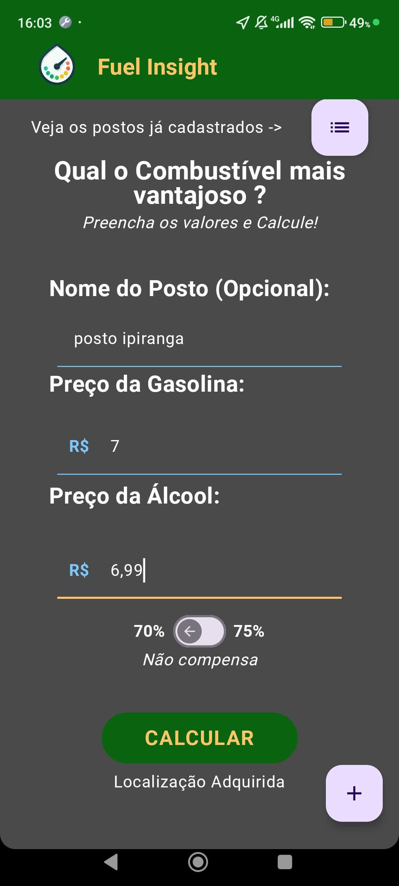
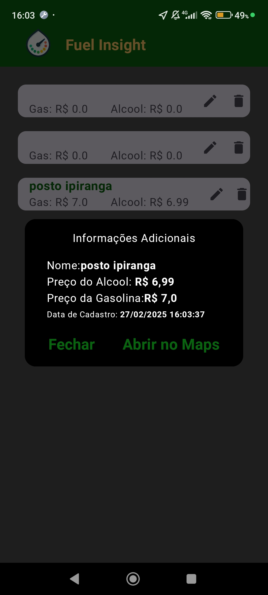
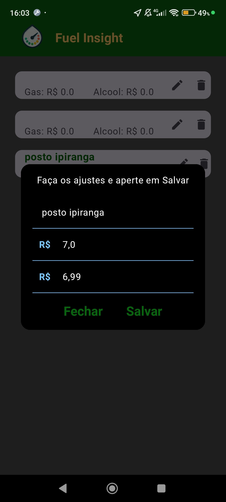
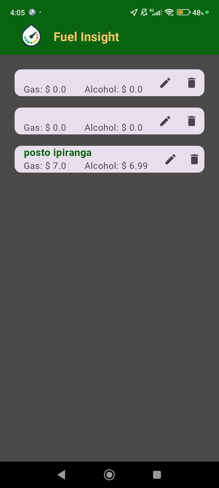

# Página inicial

# Página inicial Com GPS Ligado

# Lista de Postos

# Informações de Posto

# Editar informações de Posto

# Página inicial (en)

# Página inicial Com GPS Ligado (en)

# Lista de Postos (en)

# Informações de Posto (en)

